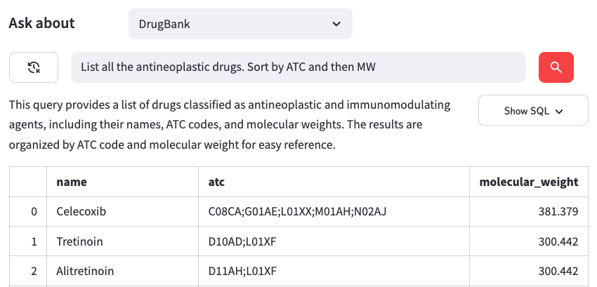
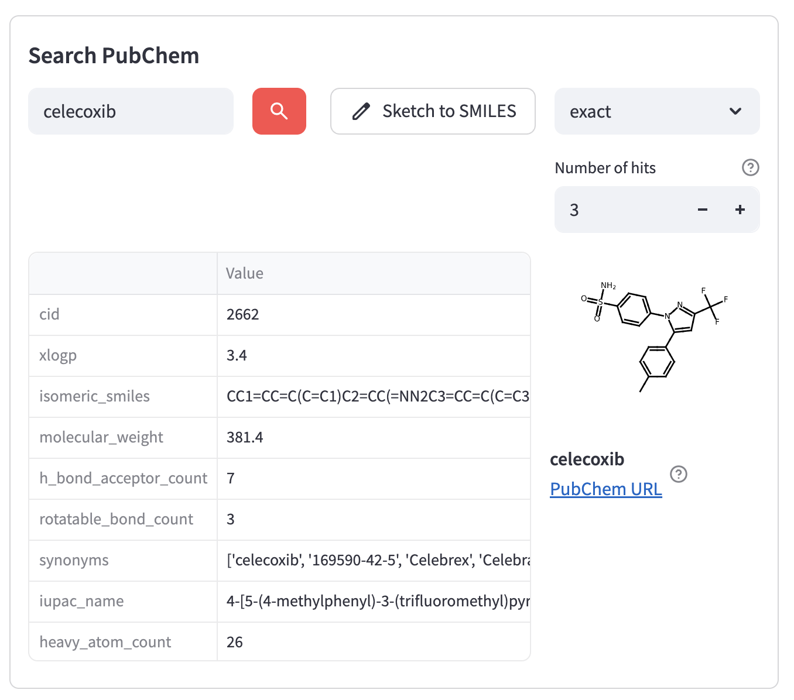
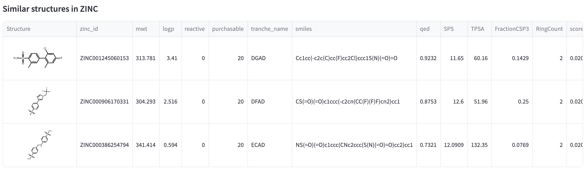

# AiChemy Solution Accelerator

## Usage
#### 1. Chat with your chemical library, e.g. Drugbank
Powered by [AI/BI Genie](https://www.databricks.com/product/business-intelligence/ai-bi-genie) to generate text-to-SQL to query your chemical library

#### 2. Search [PubChem](https://pubchem.ncbi.nlm.nih.gov/) via [PUG REST API](https://pubchem.ncbi.nlm.nih.gov/docs/pug-rest)
Supports exact/substructure/superstructure search by SMILES, name, CID

#### 3. Similarity Search
Find structurally similar molecules in your chemical library based on molecular fingerprints. Powered by [Databricks Vector Search](https://www.databricks.com/product/machine-learning/vector-search).

## Installation
1. Clone this repo into your Databricks workspace as a git folder

2. Open the Asset Bundle Editor in the Databricks UI

3. Click on "Deploy"

4. Navigate to the Deployments tab in the Asset Bundle UI (🚀 icon) and click "Run" on the job available. This will run the notebooks from this project sequentially.

NB: Genie spaces need to be created via the UI

## Contributing
1. **git clone** this project locally
2. Utilize the Databricks CLI to test your changes against a Databricks workspace of your choice
3. Contribute to repositories with pull requests (PRs), ensuring that you always have a second-party review from a capable teammate

## 📄 Third-Party Package Licenses - FILL IN WITH YOUR PROJECT'S OPEN SOURCE PACKAGES + LICENSING
&copy; 2025 Databricks, Inc. All rights reserved. The source in this project is provided subject to the Databricks License [https://databricks.com/db-license-source]. All included or referenced third party libraries are subject to the licenses set forth below.

| Package | License | Copyright |
|---------|---------|-----------|
| rdkit | Cheminformatics package (C++ and Python based) | BSD 3-Clause |
| pubchempy | Interact with PubChem in Python | MIT |
| pikachu-chem | Cheminformatics package (Python-based) | MIT |
| databricks-ai-bridge | APIs to interact with Databricks AI features such as AI/BI Genie and Vector Search | Databricks |
| databricks-sdk | SDK to interact with Databricks | Apache 2.0 |
| databricks-vectorsearch | SDK to interact with Databricks | Databricks |
| streamlit | lightweight Python framework for developing web applications | Apache 2.0 |
